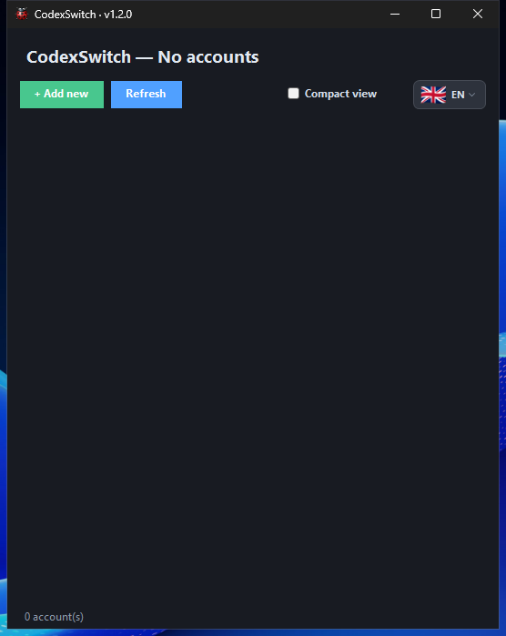

# CodexSwitch

CodexSwitch reúne tus cuentas de Codex/ChatGPT en una ventana para consultar su estado y cambiar de cuenta con rapidez, también desde la bandeja del sistema.

- **Cuentas en un solo lugar:** añade y organiza las cuentas que quieras utilizar.
- **Uso y disponibilidad:** consulta los límites y el consumo cuando la cuenta proporciona esos datos.
- **Cambio de cuenta:** selecciona la cuenta activa desde la ventana o la bandeja.
- **Interfaz en siete idiomas:** cambia el idioma sin reiniciar.

*Captura real de Windows 1.2.0.*

## Versión actual: 1.2.0 · 23 de septiembre de 2026

Gestor de cuentas Codex/ChatGPT para Windows x64. Permite cambiar de cuenta desde la ventana o la bandeja y ofrece interfaz en EN, ES, CA, FR, DE, IT y PT. Los paquetes son autónomos: no requieren instalar .NET.

| Instalador | Edición portable |
| --- | --- |
| [Descargar instalador Windows x64](https://github.com/CCRelease/Weylan/raw/refs/heads/main/CoolCode/Release/CodexSwitch/versions/1.2.0/CodexSwitch-1.2.0-win-x64-setup.exe) | [Descargar ZIP Windows x64](https://github.com/CCRelease/Weylan/raw/refs/heads/main/CoolCode/Release/CodexSwitch/versions/1.2.0/CodexSwitch-1.2.0-win-x64-portable.zip) |

Comprueba el hash antes de ejecutar. El instalador crea un acceso en Inicio y se desinstala desde **Aplicaciones instaladas**. La edición portable se usa tras extraer todo el ZIP y ejecutar `CodexSwitch.exe`; se retira eliminando esa carpeta. Las preferencias personales permanecen en el perfil de usuario.

[Instrucciones, firmas y verificación](versions/1.2.0/INSTALL.md) · [Versión vigente en JSON](latest.json).

### Historial

- [1.2.0](versions/1.2.0/INSTALL.md) — primera entrega con seguimiento formal; gestión de cuentas, indicadores y vista compacta.
