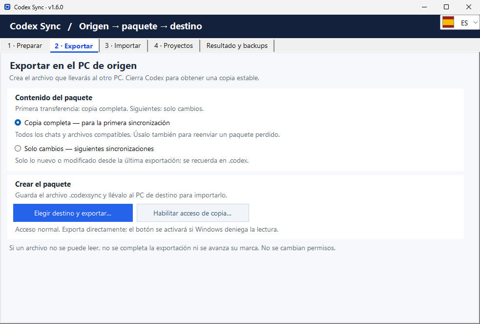

# CodexSync

CodexSync transporta el contenido compatible de Codex de un ordenador a otro mediante un paquete .codexsync. Permite llevar conversaciones y referencias de proyectos al equipo de destino sin copiar las carpetas de código.

- **Exportar e importar:** prepara el paquete en el PC de origen e impórtalo en el PC de destino.
- **Copia completa o cambios:** elige la modalidad que corresponde a la transferencia.
- **Proyectos en otra ubicación:** actualiza sus referencias cuando la ruta local cambia; la app no mueve sus archivos.
- **Revisión y backups:** consulta el resultado y las copias de respaldo del proceso.

*Captura de Windows 1.6.0: exportación de una copia completa.*

## Versión actual: 1.6.0 · 24 de septiembre de 2026

Sincroniza la configuración de Codex entre equipos mediante exportación e importación de paquetes.
La interfaz admite EN, ES, CA, FR, DE, IT y PT. Los paquetes Windows x64 son autónomos y no requieren instalar .NET.

| Instalador | Edición portable |
| --- | --- |
| [Descargar instalador Windows x64](https://github.com/CCRelease/Weylan/raw/refs/heads/main/CoolCode/Release/CodexSync/versions/1.6.0/CodexSync-1.6.0-win-x64-setup.exe) | [Descargar ZIP Windows x64](https://github.com/CCRelease/Weylan/raw/refs/heads/main/CoolCode/Release/CodexSync/versions/1.6.0/CodexSync-1.6.0-win-x64-portable.zip) |

Comprueba el hash antes de ejecutar. El instalador crea un acceso en Inicio y se desinstala desde **Aplicaciones instaladas**. La edición portable se usa tras extraer todo el ZIP y ejecutar `CodexSync.exe`; se retira eliminando esa carpeta.

[Instrucciones, firmas y verificación](versions/1.6.0/INSTALL.md) · [Versión vigente en JSON](latest.json).

### Historial

- [1.6.0](versions/1.6.0/INSTALL.md) — Interfaz multilingüe EN, ES, CA, FR, DE, IT y PT; selector con banderas y cambio inmediato de avisos y progreso.
