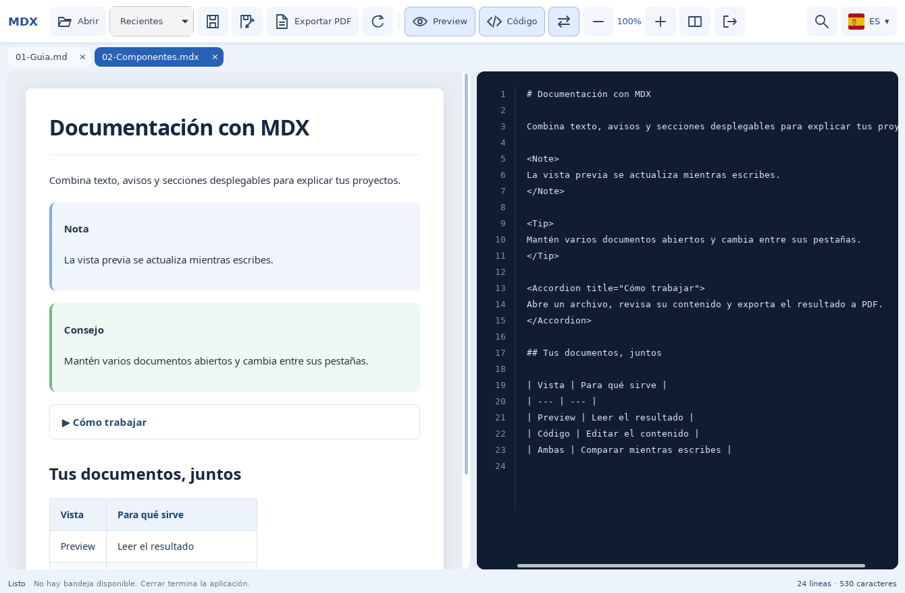

# MDX Viewer

MDX Viewer permite leer y editar documentos Markdown y MDX en una misma ventana. Está pensado para preparar documentación, revisar el resultado mientras escribes y compartirlo como PDF.

- **Vista previa y código juntos:** compara el documento con su contenido editable y ajusta el espacio de cada panel.
- **Varios documentos en pestañas:** cambia de archivo sin perder las ediciones pendientes.
- **Documentación con formato:** visualiza tablas, bloques de código, avisos, secciones desplegables y diagramas Mermaid compatibles.
- **Herramientas de trabajo:** busca texto, guarda los cambios, exporta a PDF y cambia el idioma de la interfaz.

*Captura real de Linux 1.0.3 con documentos de prueba: vista previa a la izquierda y código a la derecha.*

## Versiones y descargas

Versiones actuales: **Windows 1.6.10 · Linux 1.0.3** — publicadas el 5 de octubre de 2026. Paquetes autónomos con .NET 10 incluido.

| Plataforma | Instalador | Portable |
| --- | --- | --- |
| Windows 10/11 x64 · 1.6.10 | [Descargar EXE](https://github.com/CCRelease/Weylan/raw/refs/heads/main/CoolCode/Release/MDXViewer/versions/1.6.10/MDXViewer-1.6.10-win-x64-setup.exe) | [Descargar ZIP](https://github.com/CCRelease/Weylan/raw/refs/heads/main/CoolCode/Release/MDXViewer/versions/1.6.10/MDXViewer-1.6.10-win-x64-portable.zip) |
| Ubuntu 24.04 x64 · 1.0.3 | [Descargar DEB](https://github.com/CCRelease/Weylan/raw/refs/heads/main/CoolCode/Release/MDXViewer/versions/1.0.3/coolcode-mdxviewer-linux_1.0.3_amd64.deb) | [Descargar TAR.GZ](https://github.com/CCRelease/Weylan/raw/refs/heads/main/CoolCode/Release/MDXViewer/versions/1.0.3/mdxviewer-linux-1.0.3-linux-x64.tar.gz) |

## Instalar y utilizar

Windows: ejecuta el instalador después de comprobar su hash. Crea los accesos del escritorio y de Inicio. Requiere Microsoft Edge WebView2 Runtime; no requiere instalar .NET. Para desinstalar, elige Salir en la bandeja y usa Aplicaciones instaladas.

Linux: ejecuta sudo apt install ./coolcode-mdxviewer-linux_1.0.3_amd64.deb desde la carpeta descargada. Instala las dependencias GTK/WebKitGTK y los accesos de menú y escritorio. Para desinstalar, elige Salir y ejecuta sudo apt remove coolcode-mdxviewer-linux. X11/Xfce probado; otros escritorios pueden utilizar AppIndicator y GNOME puede necesitar su extensión.

Portable: extrae todo en una carpeta nueva y ejecuta MDXViewer.exe en Windows o MDXViewer.Linux en Linux. Necesita WebView2 o GTK/WebKitGTK respectivamente. Extraer el archivo no registra una instalación. Las instrucciones detallan cómo crear un acceso con icono. Para retirarlo, sal de la app y elimina el acceso y la carpeta extraída.

Los documentos y las preferencias del usuario se conservan. La búsqueda se abre a la derecha debajo de la lupa. Linux incluye iconos en la barra, lista de documentos por hover en X11 y selección inmediata desde bandeja.

## Integridad

Los ejecutables propios Windows, el instalador y el desinstalador tienen firma Authenticode. Ambos conjuntos de paquetes incluyen hashes SHA-256 y manifiestos firmados mediante CMS, junto con el certificado público. Es un certificado privado: Windows puede mostrar un aviso de editor desconocido. Comprueba la huella y los hashes antes de aceptar.

[Windows: instrucciones y firmas](versions/1.6.10/INSTALL.md) · [Linux: instrucciones y firmas](versions/1.0.3/INSTALL.md) · [Versiones y hashes en JSON](latest.json).

## Historial

- [Windows 1.6.10](versions/1.6.10/INSTALL.md): instalador y portable firmados, accesos de escritorio e Inicio, buscador bajo la lupa y compilación en bin/Release.
- [Linux 1.0.3](versions/1.0.3/INSTALL.md): instalador y portable con manifiesto firmado; creación y retirada automáticas del acceso de escritorio; conserva iconos, buscador y bandeja X11.