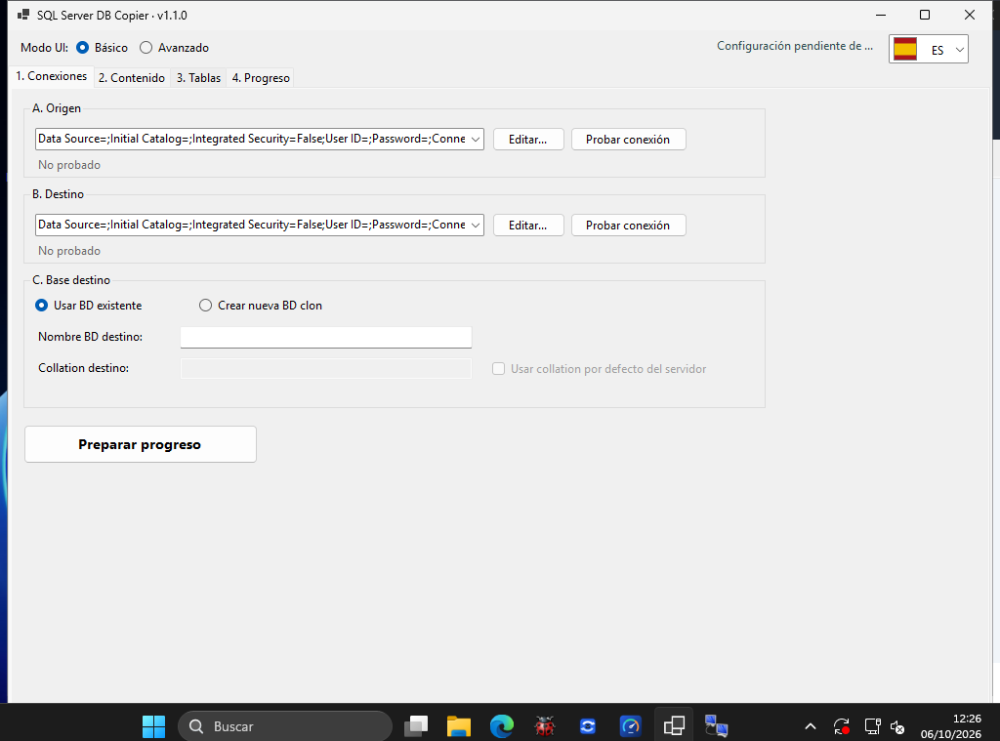

# SQLDbCopier

SQLDbCopier permite revisar y copiar contenido entre bases de datos SQL Server. Organiza las conexiones, la selección de tablas y las opciones de copia en una interfaz para preparar y seguir el proceso.

- **Origen y destino:** configura las conexiones con las bases de datos que vas a utilizar.
- **Revisión de contenido:** explora las tablas y elige qué copiar.
- **Base de destino:** utiliza una base existente o prepara una nueva base clon.
- **Seguimiento:** consulta el progreso y el resultado de la ejecución.

*Captura real de Windows 1.1.0.*

## Versión actual: 1.1.0 · 24 de septiembre de 2026

Analiza y copia contenido entre bases de datos SQL Server con opciones de conexión y seguimiento del proceso.
La interfaz admite EN, ES, CA, FR, DE, IT y PT. Los paquetes Windows x64 son autónomos y no requieren instalar .NET.

| Instalador | Edición portable |
| --- | --- |
| [Descargar instalador Windows x64](https://github.com/CCRelease/Weylan/raw/refs/heads/main/CoolCode/Release/SQLDbCopier/versions/1.1.0/SQLDbCopier-1.1.0-win-x64-setup.exe) | [Descargar ZIP Windows x64](https://github.com/CCRelease/Weylan/raw/refs/heads/main/CoolCode/Release/SQLDbCopier/versions/1.1.0/SQLDbCopier-1.1.0-win-x64-portable.zip) |

Comprueba el hash antes de ejecutar. El instalador crea un acceso en Inicio y se desinstala desde **Aplicaciones instaladas**. La edición portable se usa tras extraer todo el ZIP y ejecutar `SqlServerDbCopier.App.exe`; se retira eliminando esa carpeta.

[Instrucciones, firmas y verificación](versions/1.1.0/INSTALL.md) · [Versión vigente en JSON](latest.json).

### Historial

- [1.1.0](versions/1.1.0/INSTALL.md) — Interfaz multilingüe EN, ES, CA, FR, DE, IT y PT; selector con banderas, traducción inmediata y ajustes en conexiones y copia.
