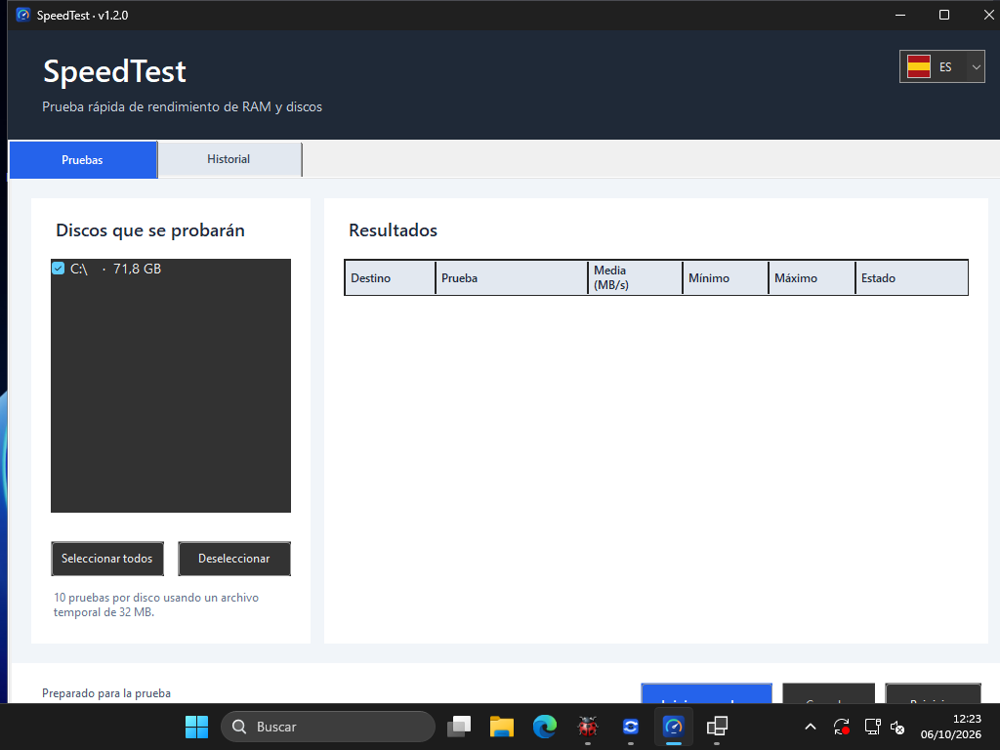

# SpeedTest

SpeedTest mide el rendimiento local de la memoria RAM y de los discos para comparar equipos o comprobar cómo cambian sus resultados con el tiempo.

- **Pruebas de memoria y discos:** mide copia de RAM, escritura y lectura en las unidades seleccionadas.
- **Resultados de cada prueba:** consulta medias, mínimos y máximos.
- **Historial y gráficas:** compara ejecuciones anteriores y observa su evolución.
- **Índice global:** reúne las mediciones en un indicador de comparación.

*Captura real de Windows 1.2.0.*

## Versión actual: 1.2.0 · 23 de septiembre de 2026

Pruebas locales de RAM y discos con historial, gráficas e índice global para Windows x64. Interfaz en EN, ES, CA, FR, DE, IT y PT. Los paquetes son autónomos: no requieren instalar .NET.

| Instalador | Edición portable |
| --- | --- |
| [Descargar instalador Windows x64](https://github.com/CCRelease/Weylan/raw/refs/heads/main/CoolCode/Release/SpeedTest/versions/1.2.0/SpeedTest-1.2.0-win-x64-setup.exe) | [Descargar ZIP Windows x64](https://github.com/CCRelease/Weylan/raw/refs/heads/main/CoolCode/Release/SpeedTest/versions/1.2.0/SpeedTest-1.2.0-win-x64-portable.zip) |

Comprueba el hash antes de ejecutar. El instalador crea un acceso en Inicio y se desinstala desde **Aplicaciones instaladas**. Para la edición portable, extrae el ZIP y ejecuta `SpeedTest.exe`. Las pruebas de disco escriben archivos temporales en las unidades seleccionadas.

[Instrucciones, firmas y verificación](versions/1.2.0/INSTALL.md) · [Versión vigente en JSON](latest.json).

### Historial

- [1.2.0](versions/1.2.0/INSTALL.md) — primera entrega con seguimiento formal; historial, gráficas, índice global y siete idiomas.
