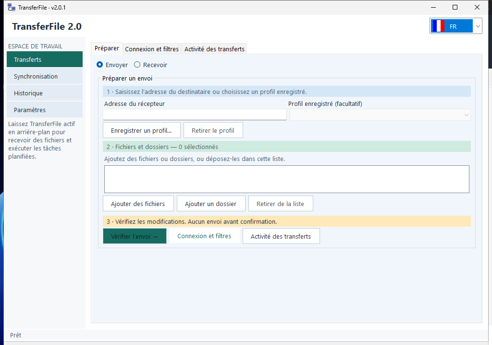

# TransferFile

TransferFile envía y recibe archivos entre equipos Windows y Linux. Permite preparar una transferencia desde una interfaz gráfica y conectarse directamente al otro equipo o utilizar el servicio de conexión de CoolCode.

- **Archivos entre equipos:** selecciona qué enviar y dónde recibirlo.
- **Conexión directa o mediante servicio:** elige la ruta disponible entre los equipos.
- **Configuración de la transferencia:** revisa el destinatario y las opciones antes de iniciar.
- **Seguimiento:** consulta el avance y el resultado del envío.

*Captura real de Windows 2.0.1.*

## Versión actual: 2.0.1 · 23 de septiembre de 2026

TransferFile permite enviar y recibir archivos entre equipos Windows y Linux, por conexión directa o mediante el servicio de conexión de CoolCode. Los paquetes son autónomos: no requieren instalar .NET.

| Sistema | Instalador | Portable |
| --- | --- | --- |
| Windows x64 | [Descargar instalador](https://github.com/CCRelease/Weylan/raw/refs/heads/main/CoolCode/Release/TransferFile/versions/2.0.1/TransferFile-2.0.1-win-x64-setup.exe) | [Descargar ZIP](https://github.com/CCRelease/Weylan/raw/refs/heads/main/CoolCode/Release/TransferFile/versions/2.0.1/TransferFile-2.0.1-win-x64-portable.zip) |
| Debian/Ubuntu x64 | [Descargar paquete DEB](https://github.com/CCRelease/Weylan/raw/refs/heads/main/CoolCode/Release/TransferFile/versions/2.0.1/TransferFile-2.0.1-linux-x64-setup.deb) | [Descargar TAR.GZ](https://github.com/CCRelease/Weylan/raw/refs/heads/main/CoolCode/Release/TransferFile/versions/2.0.1/TransferFile-2.0.1-linux-x64-portable.tar.gz) |

Lee las [instrucciones de instalación, desinstalación y verificación](versions/2.0.1/INSTALL.md) antes de usar los paquetes. Las firmas y hashes están en la misma carpeta de la versión.

### Historial

- [2.0.1](versions/2.0.1/INSTALL.md) — versión visible y metadatos unificados; permisos corregidos en el paquete Linux.
- [2.0.0](versions/2.0.0/INSTALL.md) — primera publicación de Windows y Linux en .NET 10.

La versión vigente también figura en [latest.json](latest.json). Las versiones anteriores permanecen en `versions/`.
