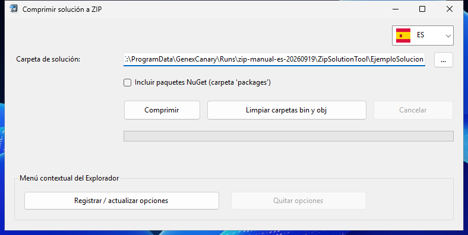

# ZipSolutionTool

ZipSolutionTool prepara copias ZIP de soluciones Visual Studio y ayuda a recuperar espacio revisando sus carpetas de compilación.

- **Comprimir una solución:** crea un ZIP con la opción de incluir o excluir los paquetes NuGet.
- **Revisar bin y obj:** localiza carpetas de compilación y consulta sus tamaños.
- **Seleccionar antes de borrar:** utiliza las casillas y filtros para revisar qué carpetas vas a eliminar.
- **Acceso desde el Explorador:** registra las opciones del menú contextual para trabajar desde una carpeta.

*Captura real de Windows 1.2.0, tomada el 19 de septiembre de 2026 con una solución ficticia.*

## Versión actual: 1.2.0 · 23 de septiembre de 2026

Herramienta para comprimir soluciones Visual Studio y limpiar carpetas de compilación en Windows x64. Interfaz en EN, ES, CA, FR, DE, IT y PT. Los paquetes son autónomos: no requieren instalar .NET.

| Instalador | Edición portable |
| --- | --- |
| [Descargar instalador Windows x64](https://github.com/CCRelease/Weylan/raw/refs/heads/main/CoolCode/Release/ZipSolutionTool/versions/1.2.0/ZipSolutionTool-1.2.0-win-x64-setup.exe) | [Descargar ZIP Windows x64](https://github.com/CCRelease/Weylan/raw/refs/heads/main/CoolCode/Release/ZipSolutionTool/versions/1.2.0/ZipSolutionTool-1.2.0-win-x64-portable.zip) |

Comprueba el hash antes de ejecutar. El instalador crea un acceso en Inicio y se desinstala desde **Aplicaciones instaladas**. Para la edición portable, extrae el ZIP completo y ejecuta `ZipSolutionTool.exe`. Si registras opciones en el Explorador, quítalas desde la app antes de desinstalar o retirar el portable. Revisa siempre la selección antes de limpiar `bin` y `obj`.

[Instrucciones, firmas y verificación](versions/1.2.0/INSTALL.md) · [Versión vigente en JSON](latest.json).

### Historial

- [1.2.0](versions/1.2.0/INSTALL.md) — primera entrega con seguimiento formal; compresión, limpieza, filtros y siete idiomas.
